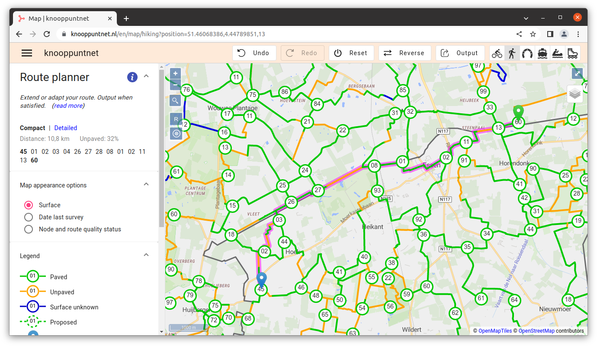
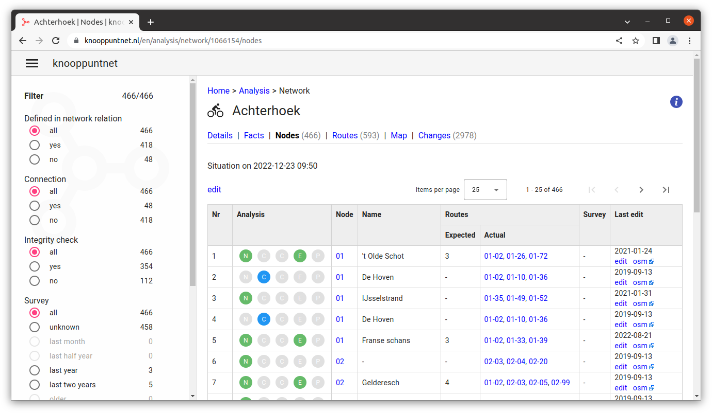
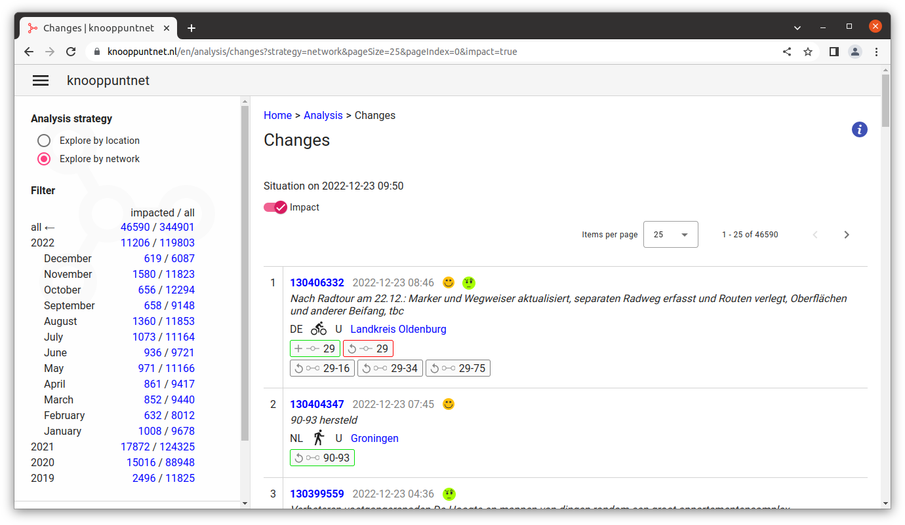
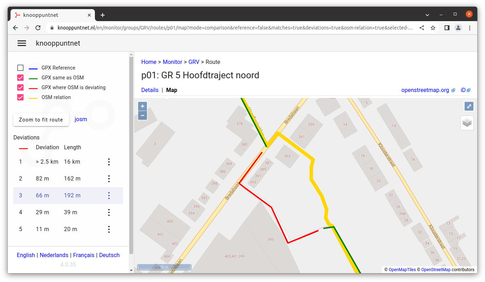

# knooppuntnet

Table of contents

- [About](#about)
- [Screenshots](#screenshots)
- [How to contribute?](#contribute)
  - [Translations](#translations)
  - [OpenStreetMap mapping](#mapping)
  - [Reporting issues](#issues)
- [Credits](#credits)

## About

_Knooppuntnet_ is a website for planning routes through walking,
cycling and other types of node networks in OpenStreetMap. It provides support for
analysis and quality assurance of these networks, and monitoring long distance walking routes.

- [knooppuntnet.nl](https://knooppuntnet.nl)

- [wiki documentation](https://wiki.openstreetmap.org/wiki/Knooppuntnet)

## Screenshots

You can plan a walking route by clicking on a start node and destination node 
(and optionally intermediate nodes that you want to pass through). You can output
the planned route in a pdf document and/or a gpx track.

In the analysis section of knooppuntnet, you can get an overview of all nodes and routes
in a given node network, and explore issues that knooppuntnet finds. Directs links to
editors make it easier to fix problems in the OpenStreetMap database.

You can look at the changes to the OpenStreetMap database that affect the node networks in near realtime.

For long distance walking routes, you can compare GPX traces with the mapping of the
route in OpenStreetMap.  This allows you to find problems in the OpenStreetMap database
and/or the GPX trace.

## How to contribute?

Here are a number of ways of how to contribute to the project:

- validate routes on the ground

- map additional nodes/routes/networks

- report errors

- application translation

- documentation

- application testing

- application code

### Translations

The intention is to have _knooppuntnet_ available in four languages: English, Dutch, German and French.

#### Wiki

The application documentation is in the [OpenStreetMap wiki](https://wiki.openstreetmap.org/wiki/Knooppuntnet). Feel
free
to add to this and/or translate to other languages.

#### Application

Your help in translating the application to a language that is not fully translated yet, or
to fix wrong translations, is very welcome.

The base language for the application is English. Support for translation to the other languages
is kindly provided free of charge by [POEditor](https://poeditor.com). POEditor supports
open source. Many thanks!!!

Follow this [link](https://poeditor.com/join/project/Bfvs2fvcYI) to join the knooppuntnet translation project.

From the project start page you can select the language. In the _"Translations"_ tab you can review all translations
(select _"Show: translated"_), or bring up the list with all texts that still need translation (select _"Show:
Untranslated"_).
From these lists the translated texts can be entered and/or changed. Click the text to start editing.

All the translations you make here will appear in the knooppuntnet website in the next release.

The above is sufficient to help out with the translations.

A bit more advanced: if you like to review your translation changes without waiting for the next release,
you can follow the instructions in the section _"Install application locally"_ below.

In the POEditor page for your language, you can go to the _"Export"_ tab. Select _"Show Advanced Options"_.
Select _"Export: All"_ and _"Filename: translations.XX.xlf"_ where XX is the 2 letter code for given language:

| Language | Command             
|----------|---------------------
| Dutch    | translations.nl.xlf 
| German   | translations.de.xlf 
| French   | translations.fr.xlf 

Klik _"Export"_ and save the file in the _"locale"_ directory in your git clone:

	knooppuntnet/client/src/locale

To see your translations in action, restart the application in development for given
language, for example:

	yarn run start:de

Note: changes to the English texts have to be done directly in the application code.

### Install application locally

These are the instructions for installing the client application on your local computer (for development purposes).

#### yarn

We use _"yarn"_ to manage the software dependencies and to help in installing
and running the client application.

Go to [yarn](https://yarnpkg.com), click the install button, and follow the
instructions for your operating system.

#### git

We use git as our version control system. Although it is also possible to download
the code as a zip file, it will be easier to immediately use git, especially if the
intention is to contribute to the project afterwards.

Go to [git downloads](https://git-scm.com/downloads) and follow the installation instructions.

#### Install and run

Get the source code:

	git clone https://github.com/vmarc/knooppuntnet.git

Install the software and fetch all dependencies:

	cd knooppuntnet/client/
	yarn install

Build and run the client:

	yarn run start:en

The above command will build and start the English version of the application in development mode.
Use one of the following commands to start the application in another language:

| Language | Command             
|----------|---------------------
| English  | `yarn run start:en` 
| Dutch    | `yarn run start:nl` 
| German   | `yarn run start:de` 
| French   | `yarn run start:fr` 

When starting the application in a language other than English, the texts that are not translated yet are shown in
English.

### OpenStreetMap mapping

You can contribute by adding, updating or reviewing the node and route definitions
in OpenStreetMap. Any changes made there will become available in the application soon
after upload to OpenStreetMap.

### Reporting issues

Issues can be reported in [github](https://github.com/vmarc/knooppuntnet/issues), or through
an OpenStreetMap message to [vmarc](https://www.openstreetmap.org/message/new/vmarc).

> _Note: when submitting issues, please feel free to use English, Dutch, French or German._

### Application testing

Review these
documented [planner interaction tests](https://github.com/vmarc/knooppuntnet/blob/develop/docs/planner-interactions.md).

## Credits

Knooppuntnet is happy to use an [IDE](https://en.wikipedia.org/wiki/Integrated_development_environment) from JetBrains who provided an [open source license](https://jb.gg/OpenSourceSupport).

Translation support for the appication is provided by for free by
[POEditor](https://poeditor.com/) (supporter of open source projects).
You can [join the translation effort](https://poeditor.com/join/project/Bfvs2fvcYI)
at their web-site.

All map data is coming from [OpenStreetMap](http://www.openstreetmap.org).

Background map tiles are created with [OpenMapTiles](https://openmaptiles.org) using OpenStreetMap data extracts
provided by [Geofabrik](https://www.geofabrik.de/).

The client is using [Angular](https://angular.io/), [Typescript](https://www.typescriptlang.org/)
and [OpenLayers](https://openlayers.org/).

The server is using the [Scala](https://www.scala-lang.org/) programming language,
[SpringBoot](https://spring.io/projects/spring-boot),
[MongoDB](https://www.mongodb.com/) database,
a local [OverpassAPI](http://overpass-api.de/) instance,
[JTS topology suite](https://locationtech.github.io/jts/),
[JGraphT](https://jgrapht.org/),
[ScalaTest](https://www.scalatest.org/)
and others.

Point of interest icons are by [Map Icons Collection](https://mapicons.mapsmarker.com).

Other icons are from [www.flaticon.com](https://www.flaticon.com) and are licensed by
[CC 3.0 BY](http://creativecommons.org/licenses/by/3.0/).
These icons are made by:
[Scott de Jonge](https://www.flaticon.com/authors/scott-de-jonge),
[Vitaly Gorbachev](https://www.flaticon.com/authors/vitaly-gorbachev),
[Freepik](https://www.freepik.com/),
[Plainicon](https://www.flaticon.com/authors/plainicon),
[Google](https://www.flaticon.com/authors/google),
[Smashicons](https://www.flaticon.com/authors/smashicons),
[dmitri13](https://www.flaticon.com/authors/dmitri13) and
[Roundicons](https://www.flaticon.com/authors/roundicons).
