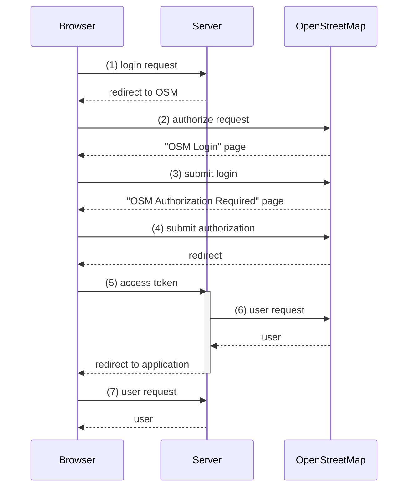

# Authentication

## Why authentication?

All of the knooppuntnet information/functionality is accessible to all without login, with two exceptions:

1) Changeset information. Public access to the history information has been restricted since 2018 as a result of the proposed data availability and access documented in the [OpenStreetMap GDPR Position Paper](https://wiki.openstreetmap.org/w/images/8/88/GDPR_Position_Paper.pdf) appendix B.


2) In the long distance route monitor pages, the functions for adding or updating route monitor definitions are behind a login. This is to avoid unlimited adding of routes.  Monitoring long distance routes requires quite a lot of server resources (cpu and memory) and the analysis server could easily be overloaded if routes could be added without limit.  

## Concept

When the user is logged in, an http only cookie set by the server with key "knooppuntnet" contains a encoded and signed token that includes the OpenStreetMap name of the logged in user.

The knooppuntnet application that runs on the browser does not have direct access to read this username from this token. When the application starts, a request is sent to the knooppuntnet server that responds with the user name that is encoded in the cookie.

```
https://knooppuntnet.nl/oauth2/user
```

If no username is returned, then the  user is not currently logged in.  A login link is shown in the sidebar bottom. 

If a username is returned, the username is shown in the sidebar bottom, together with a logout link.

In order for the server to set the "knooppuntnet" cookie initially, the user has to login once via OpenStreetMap, and grant access to knooppuntnet to read the OSM user name.


## Login sequence



---

__(1) login request__

When the user clicks the login link, the knooppuntnet application in the browser sends a login request to the knooppuntnet server:

```
http://knooppuntnet.nl/api/oauth2/authorization/osm
```

The _AuthenticationReturnUrlFilter_ intercepts the request and reads the "Referer" http header to determine the url from which the authorization request was initiated. This url is stored in the "RETURN_URL" session attribute.

The response to the login request is a redirect (http code 302) to the OpenStreetMap oauth2 authorization endpoint:

```
https://www.openstreetmap.org/oauth2/authorize
  ?response_type=code
  &client_id=<...>
  &scope=read_prefs
  &state=<...>
  &redirect_uri=https://knooppuntnet.nl/api/oauth2/code/osm
```

The request contains the _client_id_ (read from the knooppuntnet server configuration) with which _knooppuntnet_ is registered as an oauth2 application in OpenStreetMap. 

The _redirect_uri_ parameter points to the knooppuntnet address that OSM will redirect to after authentication/authorization. 

The response includes a session cookie:

```
SESSION=<first session cookie value>; Path=/; HttpOnly; SameSite=Lax
```

This session will be used to pick up the _RETURN_URL_ after authentication to redirect to the knooppuntnet page from which the login link was clicked.

---

__(2) authorize request__

After receiving the redirect response from the login request, the browser issues the authorize request to OpenStreetMap.

If the user is currently logged in, and knooppuntnet was granted OSM access before, OSM will directly respond with a redirect to the _redirect_uri_ specified in the authorize request url parameter.  This way the two next steps (_OSM Login_ page, and _OSM Authorization required_ page) are skipped.

If the user is not currently logged in, OSM responds with a redirect to the _OSM Login_ page.

```
GET https://www.openstreetmap.org/login
```

---

__(3) submit login__

After filling in the username and password (and optionally click the "Remember me" option), the OSM login form is is submitted:

```
POST https://www.openstreetmap.org/login
```

If the user already authorized _knooppuntnet_ in the past, then OSM will respond with a redirect to the _redirect_uri_ specified in the authorize request url parameter.  This way, the next step (_OSM Authorization required_ page) is skipped.

If _knooppuntnet_ is not authorized yet, OSM redirects to the _OSM Authorization required_ page:

```
https://www.openstreetmap.org/oauth2/authorize
  ?response_type=code
  &client_id=<...>
  &scope=read_prefs
  &state=<...>
  &redirect_uri=https://experimental.knooppuntnet.be/api/oauth2/code/osm
```

Form:

> Authorization Required
> 
> Authorize knooppuntnet to access your account with the following permissions?
> 
> - Read user preferences
> 
> (Authorize)  (Deny)

---

__(4) submit authorization__

The user clicks the (Authorize) button.

```
POST https://www.openstreetmap.org/oauth2/authorize
```

OSM responds with a redirect to the _redirect_uri_ specified in the authorize request.

__(5) access token__

The code parameter contains the access token generated by OSM that will allow the knooppuntnet server to read the user preferences on behalve of the user.

```
https://knooppuntnet.nl/api/oauth2/code/osm
  ?code=<...>
  &state=<...>
```

__(6) user request__

The knooppuntnet server uses the access token that was received in the previous step to send a request to OSM to read the user preferences.

OSM responds with the user preferences. One of the preferences is the user name.

The knooppuntnet server then sends a reponse to the request in (5) with a redirect to start a new instance of the knooppunt browser application using the RETURN_URL in the session to navigate to the page that the login link was clicked from.

The response also contains the "knooppuntnet" cookie, and removel of the session cookie for the session that was used to remember the RETURN_URL during OSM login.

---

__(7) knooppuntnet user request__

After restart of the application and the receipt of the "knooppuntnet" cookie, the user is logged in, but the browser application does not know the user name yet.  A request is sent to the server to pick up the username:

```
https://knooppuntnet.nl/oauth2/user
```

---

## nginx configuration

The nginx reverse proxy configuration on the server had to be updated so that the server can compose the return uri in the authorize request  (2).  The Referer http header could not be used for this, as this always contains the address of the reverse proxy. 

```
proxy_set_header X-Forwarded-Proto $scheme;
proxy_set_header X-Forwarded-Host $http_host;
```
