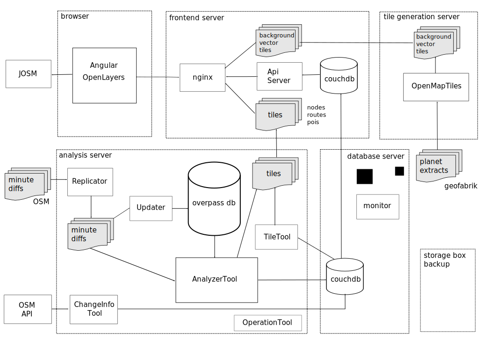

## How it works

### overview

- input

  ReplicatorTool

  UpdaterTool

- analysis

  AnalyzerTool

  rules

### Tiles

#### OpenStreetMap tiles

#### Node network tiles

#### Points of interest tiles

#### Database

#### OverpassApi database

- size

#### Couchdb master database

- documents

- views

#### Couchdb changes database

- documents

- views

#### Couchdb tasks database

- ChangesInfoTool
