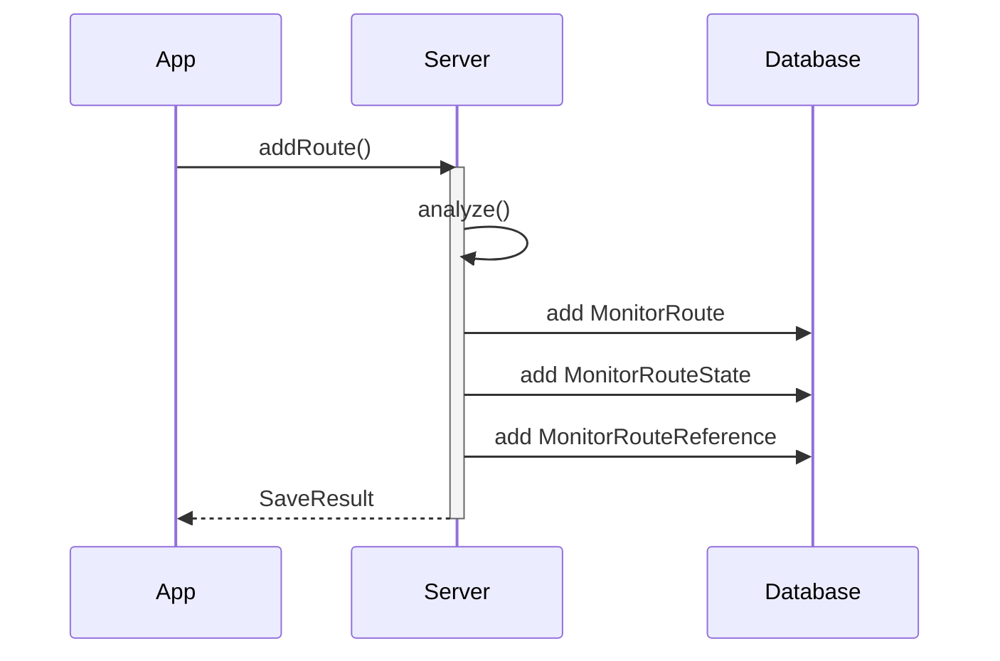
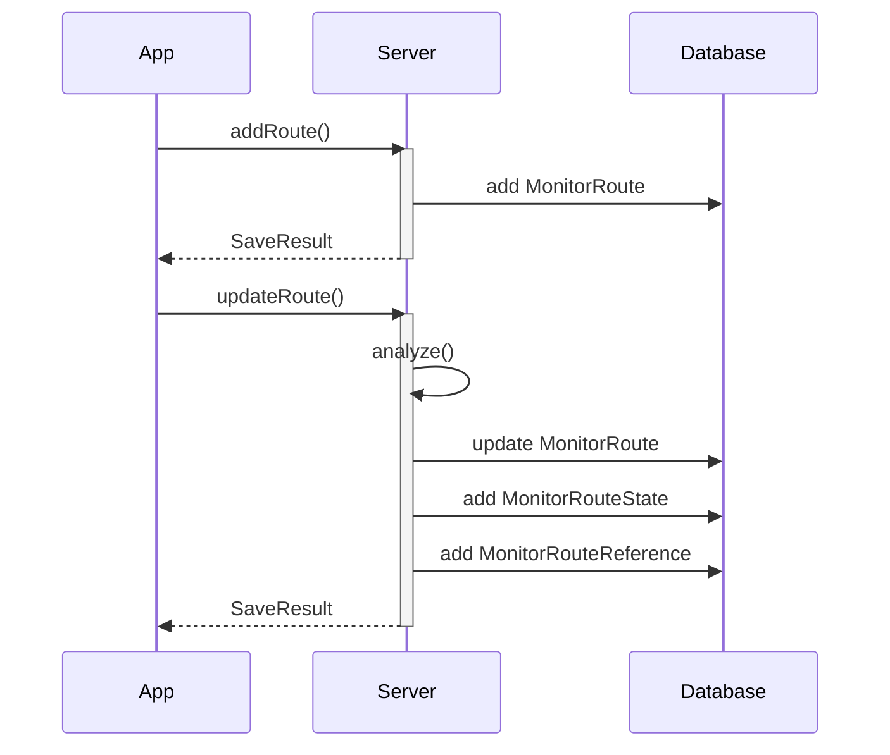
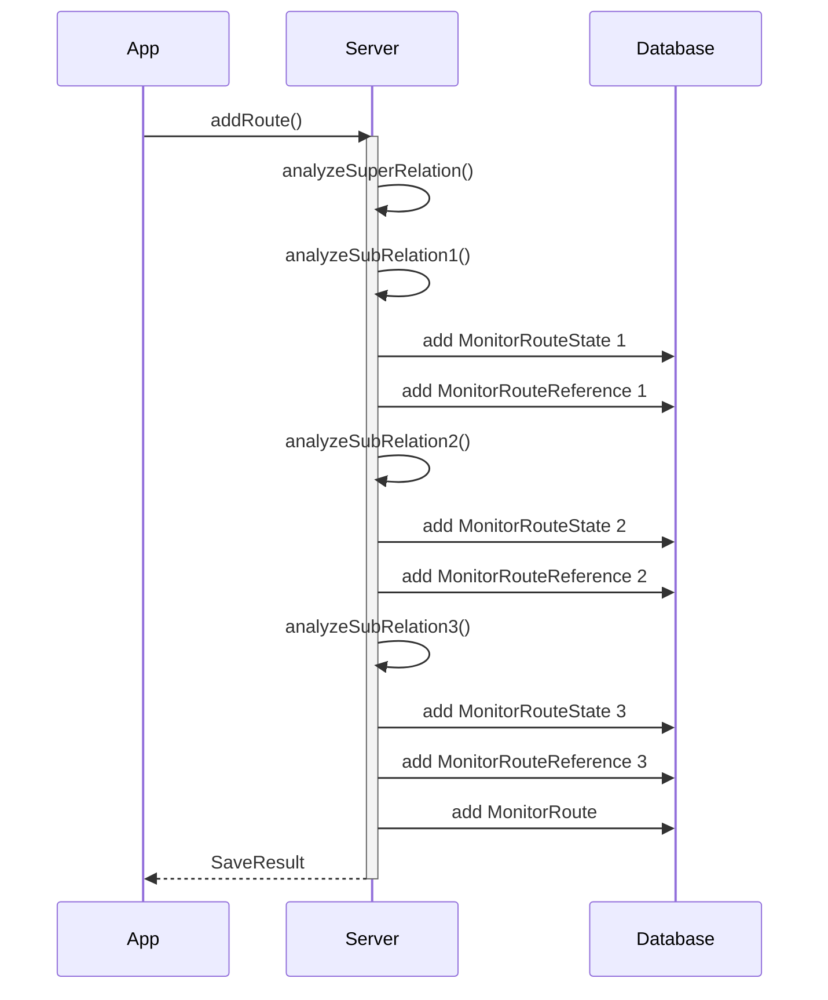
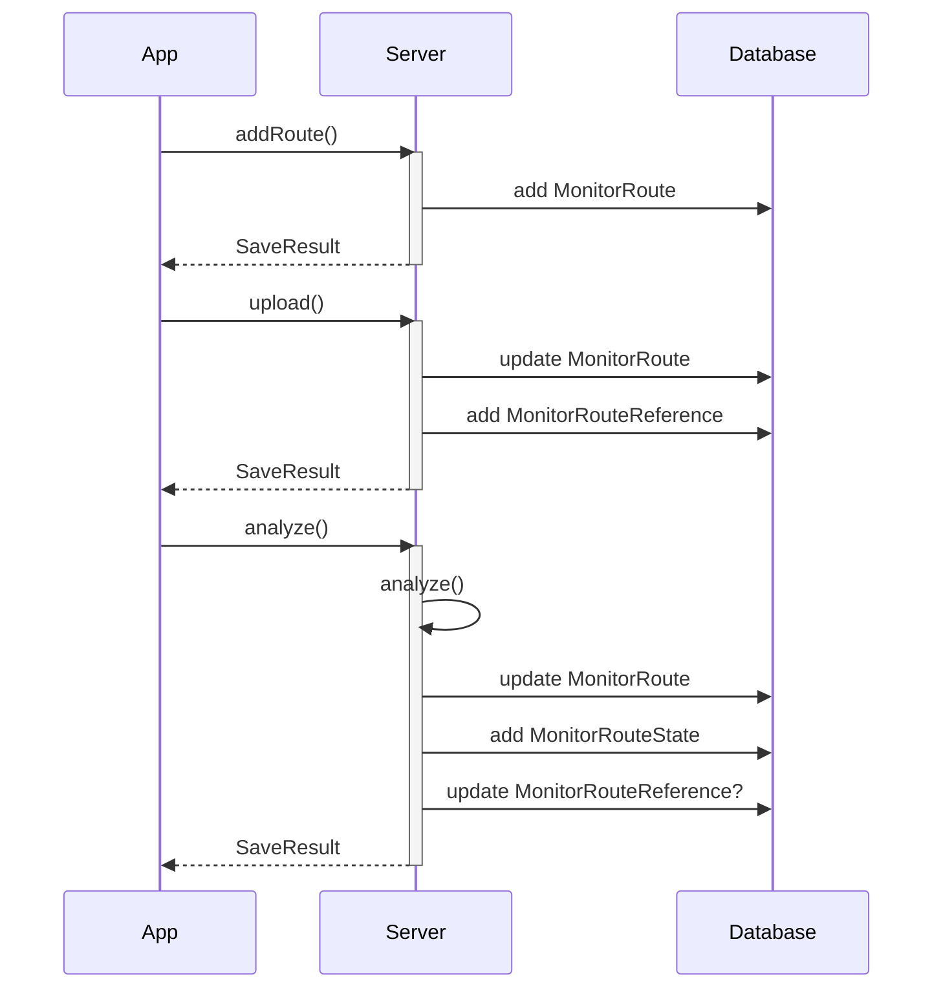
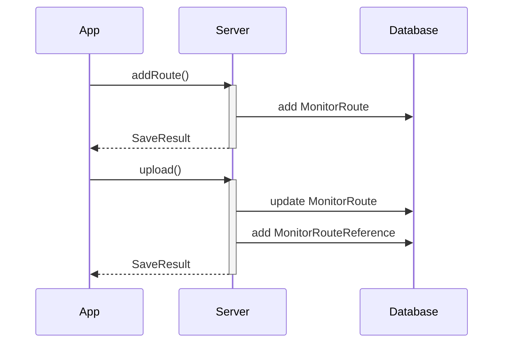
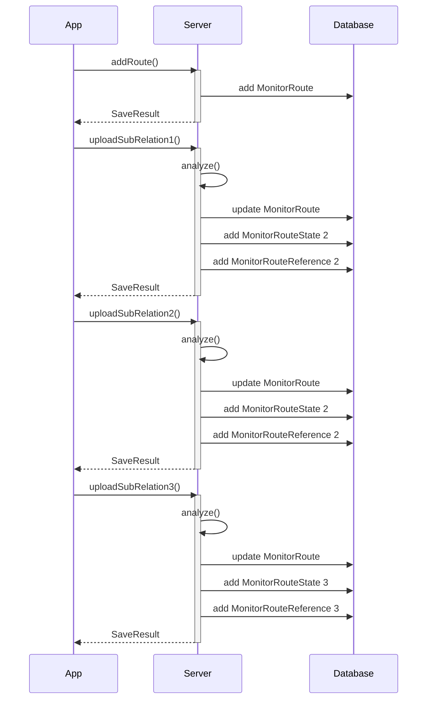
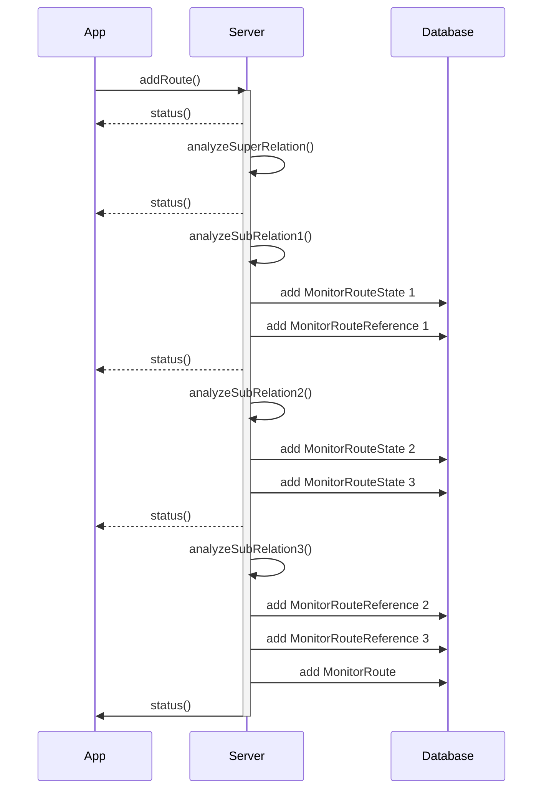
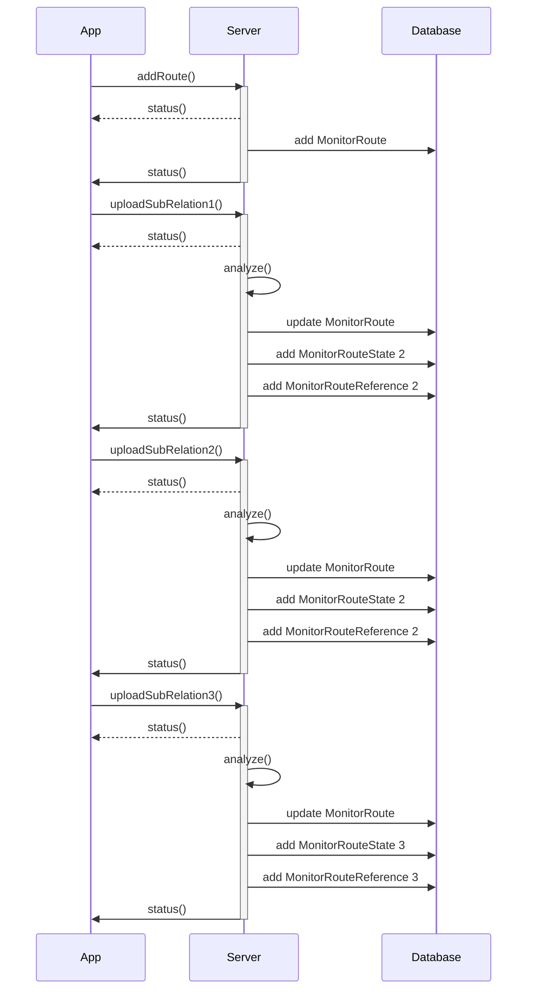

## monitor

### admin scenarios

These scenarios are tested in MonitorUpdaterTest* test classes.

### 01_osm_add

Add non-super route with reference type "osm":

### 02_osm_add_without_relation_id

Add non-super route with reference type "osm", without relation id unknown:

### 03_osm_add_super_route

Add super route with reference type "osm":

### 07_gpx_add

Add route with reference type "gpx":

### 08_gpx_add_without_relation_id

Add route with reference type "gpx", without relation id:

### 09_multi_gpx_add

Add super-route with reference type "multi-gpx":

### 03_osm_add_super_route alternative

Add super route with reference type "osm":

### 09_multi_gpx_add alternative

Add super-route with reference type "multi-gpx":

